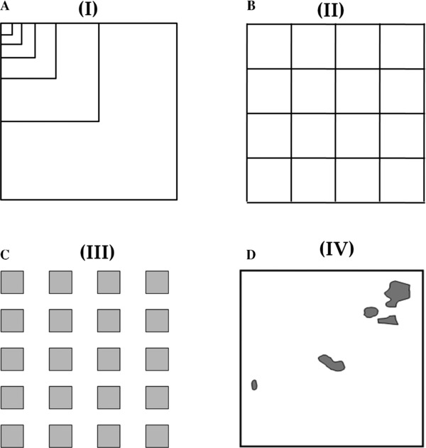

---
title: '9\. Spatial Diversity'
author: "Z620: Quantitative Biodiversity, Indiana University"
header-includes:
   - \usepackage{array}
output: pdf_document
latex_engine: xelatex
geometry: margin=2.54cm
--- 

## OVERVIEW
In this exercise, you will learn primary concepts and patterns associated with spatial diversity.
You will also be introduced to using R as a Geographic Information Systems (GIS) environment.

After completing this exercise you will be able to:  
1.  Beging using R as a geographical information systems (GIS) environment.  
2.  Identify primary concepts and patterns of spatial diversity.  
3.  Examine effects of geographic distance on community similarity.  
4.  Generate simulated spatial data.

**A GLOSSARY is provided at the end of this document for basic definitions GIS terms.**

## 1.) SETUP
### A. Retrieve and Set Your Working Directory

```{r, results = 'hide'}
rm(list=ls())
getwd()
setwd("~/GitHub/QB-2019/1.HandOuts/9.SpatialDiversity")
```

### B. Load Packages 
We will use the `vegan` package for biodiversity estimators and related functions.
We will also use a suite of packages developed in R for geographic information systems (GIS).

```{r, results = 'hide', message = FALSE, warning = FALSE} 
require(vegan)
#install.packages('sp') # Classes and methods for handling spatial data
require(sp)
#install.packages('gstat') # Methods for geostatistical analyses
require(gstat)
#install.packages('raster') # Methods to create a RasterLayer object
require(raster)
#install.packages('RgoogleMaps') # For querying the Google server for static maps. 
require(RgoogleMaps)
#install.packages('maptools') # Tools for manipulating and reading geospatial data
require(maptools)
#install.packages('rgdal') # Geospatial Data Abstraction Library
require(rgdal)
#install.packages('simba') # Similarity measures for community data
require(simba)
#install.packages('gplots') # Programming tools for plotting data
require(gplots)
#install.packages('rgeos') # Geostatistical package, used here for semivariograms
require(rgeos)
```

### C. Load a Site-by-Species matrix and Corresponding Environmental data
We will analyze environmental and bacterial community data from a survey of shallow ponds found east of Bloomington, IN.
These ponds are scattered throughout Brown County State Park, Yellowood State Forest, and Hoosier National Forest.
In the 1940s, Maury Reeves of the Indiana Department of Natural Resources began constructing refuge ponds to increase wildlife habitat.
In the summer of 2013, we visited approximately 50 of these ponds and recorded their geographic locations using a GPS unit; 'GPS' is the acronym for Global Positioning System.
We sampled aspects of water chemistry, physical properties, and bacterial community composition.

Let's load the environmental and site-by-species data for the refuge ponds.

```{r, results = 'hide', message = FALSE, warning = FALSE} 
Ponds <- read.table(file = "BrownCoData/20130801_PondDataMod.csv", head = TRUE, sep = ",")
OTUs <- read.csv(file = "BrownCoData/SiteBySpecies.csv", head = TRUE, sep = ",")
otu.names <- names(OTUs) # Get the names of the OTUs
OTUs <- as.data.frame(OTUs[-1]) # remove first column (site names)
```

Take a look at the `Environment` tab in the upper right console of RStudio. 
You should see there are 16,383 operational taxonomic units (OTUs) distributed across 51 sites, for which we have 19 environmental and geographic variables recorded. 
These variables include elevation (m), geographical coordinates (lat-long), temperature (C), pond diameter(m), pond depth (m), redox potential (ORP), specific conductivity or SpC (S/cm), dissolved oxygen (mg/L), total dissolved solids (g/L), salinity (p.s.u.= ppm), color - measured at absorbance = 660; an estimate of carbon in the water sample, chlorophyll *a* (g/ml), dissolved organic carbon (mg/L), dissolved organic nitrogen (mg/L), and total phosphorus (g/L).


## 2.) GENERATE MAPS
Creating maps has numerous, if not obvious, benefits for scientific studies.
Here, we will explore just a few ways to build maps in R.
First, let's visualize the spatial distribution of our samples with a basic map in RStudio.
Let's generate a map of the refuge ponds using the `GetMap` function in the package `RgoogleMaps`.
This map will be centered on Brown County, Indiana (39.1 latitude, -86.3 longitude).
Google requires Application Programming Interface (API) authorization, which controls access and authorization. 
If you are interested in using getting Google maps for your research, you'll need to sign up for an API here: https://developers.google.com/maps/documentation/javascript/get-api-key
Becasue the API key is linked to a credit card, we are not going to print our 39 character code. 
However, we comment out the syntax code so you can use this for your own work

```{r}
lats <- as.numeric(Ponds[, 3]) # latitudes (north and south)
lons <- as.numeric(Ponds[, 4]) # longitudes (east and west)

# newmap <- GetMap(center = c(39.1,-86.3), zoom = 10, 
#                  destfile = "PondsMap.png", maptype="terrain", 
#                 API_console_key = ".......................................")


# after running the GetMap function with your API code you can save the resulting list as an R object using the function saveRDS():

# saveRDS(newmap, file = "newmap.rds")

# Then we can read that object back in. 
# This is just a work-around for not wanting to reveal our API key, but it serves as an example of how you can save information in R in forms other than .csv or .txt files

newmap <- readRDS(file = "newmap.rds")

# 
# capture.output(newmap, file = "newmap.txt")
# newmap1 <- capture.output(newmap, file = "newmap.txt")
# 
# newmap2 <- as.list(newmap1)
# 
# newmap2 <- scan(file = "newmap.txt", what = list("", "", "","", "", "", "", ""))
# 
# newmap2 <- scan(file = "newmap.txt", what = "int")
# 
# newmap3 <- print(newmap2, quote=FALSE)


PlotOnStaticMap(newmap, zoom = 10, cex = 2, col = 'blue') # Plot map in RStudio
PlotOnStaticMap(newmap, lats, lons, cex = 1, pch = 20, col = 'red', add = TRUE)
```

This map displays useful information that we otherwise, would not have been aware of. 
First, all points are located near Bloomington, IN and are located on State land.
Second, the sampled ponds appear to be aggregated in four or five small groups and are distributed across a *topographically* complex area.
Some are close to Lake Monroe.

This Google map is a fast way to contextualize our sample ponds within the broader landscape and a neat way to connect R with the internet.
However, the Google map misses a lot of information that would otherwise help us to understand the environmental and geographical factors that may coincide with our observations.
Most importantly, because the Google map is only an image, it does not contain any extractable environmental or geographic data.

For spatially explicit data on environmental and geographic features we can turn to one of the many freely accessible online GIS databases and warehouses.
Here, we will use a high quality geospatial data on Indiana water bodies and percent tree cover.
We obtained these data 'layers' from the **IndianaMap** geographical layer gallery: http://maps.indiana.edu/layerGallery.html.

We will be importing and using special file formats called raster files and shapefiles. 
These are the two primary forms of geospatial files. 
Raster files are characterized by pixels, each of which contains recorded data (e.g., elevation, landcover). 
Shapefiles are characterized by points, lines, and polygons, and contain the shapes and locations of rivers, lakes, highways, boundaries, and any other geographical feature that is represented as a shape.

Let's build a map by combining lat-long data from our ponds with land cover data and data on the locations and shapes of surrounding water bodies.

```{r}
Tree.Cover <- raster("TreeCover/TreeCover.tif") # import TreeCover.tif as a raster file.
plot(Tree.Cover, xlab = 'Longitude', ylab = 'Latitude', 
  main = 'Map of geospatial data for % tree cover,\nwater bodies, and sample sites')

Water.Bodies <- readShapeSpatial("water/water.shp") # import water bodies as a shapefile.
plot(Water.Bodies, border='cyan', axes = TRUE, add = TRUE)

Refuge.Ponds <- SpatialPoints(cbind(lons, lats)) # convert lat-long data for ponds to georeferenced points. 
plot(Refuge.Ponds, line='r', col='red', pch = 20, cex = 1.5, add = TRUE)
```

Note, that the percent tree cover, water bodies, and points for refuge ponds are in spatial agreement, i.e., there is no mis-alignment of data layers.
This is because each layer was previously modified to have the same *datum* (model for Earth's shape) and *projection* (the way in which coordinates on a sphere are projected onto a 2-D surface).
datums and projections are fundamental to making maps and geospatial analysis.

Whether it's data on temperature, elevation, soils, geology, human demographics, ecoregions, etc., diverse data can be found among the many online and free available GIS warehouses.
Here are a few:

1) USGS: http://viewer.nationalmap.gov/viewer/
2) State organizations: http://www.indianamap.org/resources.php
3) USDA: http://datagateway.nrcs.usda.gov/


## 3. PRIMARY CONCEPTS AND PATTERNS
Having explored R as a geographical environment and having imported our primary community and environmental data from the refuge ponds, we are now ready to explore primary concepts and patterns of spatial diversity.

## A. Spatial Autocorrelation
**Tobler's first law of geography** states that "Everything is related to everything else, but near things are more related than distant things" (Tobler 1970).

This law is a formulation of the concept of spatial autocorrelation.
In short, spatial autocorrelation is the degree to which spatial variables are either clustered in space (positive autocorrelation) or over-dispersed (negative autocorrelation).

Checking for the influence of spatial autocorrelation can reveal whether differenes in, say, diversity, are simply due to how far apart in geographic distance different communities are.

**Semivariograms** reveal how spatial autocorrelation changes over scales (i.e., lags) of intersample distance.
A higher semivariance means implies lower autocorrelation.
Typically, we say that a variable ceases to be autocorrelated the semivariagram asymptotes.
The *sill* and *range* are the primary features of semivariograms.
The sill is simply the y-value at which semivariance levels off.
The range is the x-value at which the semivariance levels off.
Distances to the right of the range are the spatial lags at which the variable of interest is no longer spatially autocorrelated.

\centerline{\includegraphics[height=2.5in]{semivariogram1.jpeg}}

```{r, results = 'hide', message = FALSE, warning = FALSE, error = TRUE} 
# Construct a new dataframe for coordinates
xy <- data.frame(env = Ponds$TDS, pond.name = Ponds$Sample_ID, lats = Ponds$lat, lons = Ponds$long)
coordinates(xy) <- ~lats+lons # Transform 'xy' into a spatial points dataframe

# Identify the current projection (i.e., lat-long) and datum (NAD83). In our case, the projection and datum correspond to the settings of the GPS device used to gather data.
proj4string(xy) <- CRS("+proj=longlat +datum=NAD83") # coordinate reference system (CRS)

# Then, transform the projection and data so we can get meaningful georeferenced distances. In this case, we will use the Universal Transverse Mercator projection and the WGS1984 datum.
UTM <- spTransform(xy, CRS("+proj=utm + zone=51 ellps=WGS84")) # coordinate reference system (CRS)

UTM <- as.data.frame(UTM)
xy$lats_utm <- UTM[,2] # lattitude data according to UTM
xy$lons_utm <- UTM[,3] # longitude data according to UTM

#coordinates(xy) = ~lats_utm+lons_utm # Step required by the variogram function

# Examine the semivariance with regards to one of our environmental variables
env.vgm <- variogram(env~1, data=xy)
plot(env.vgm)
```

As we can see above, there is no particular spatial scale where our data cease to be autocorrelated.
However, there is also no consistent pattern of autocorrelation for most of our variables.

Another way to examine spatial autocorrelation is with **Moran's I**. 
Moran's I is a correlational statistic that measures autocorrelation based on the values of variables at specified geographic locations (i.e., coordinates defined by lat-long).
Like other correlational statistics, the value of Moran's I varies between -1 (perfectly negatively correlated) and 1 (perfectly positively correlated).

Moran's I is generally considered to be a 'global' statistic, quantifying spatial autocorrelation across the entire 2-D landscape into a single number.

```{r, message = FALSE, warning=FALSE} 
Moran(Tree.Cover)
```

Here, we see values for percent land cover are highly autocorrelated across the landscape.
For a visually informative picture, we can use R's `raster` package to visualize autocorrelation using a local version of Moran's I.

```{r, results = 'hide'} 
TC.Moran <- MoranLocal(Tree.Cover)
plot(TC.Moran, xlab="Longitude", ylab="Latitude", 
     main="Spatial autocorrelation in % tree cover\nacross our sampled landscape",
     col=rainbow(11, alpha=1))
```


## Pattern 1: Distance-decay relationship
The geograhpic distance-decay relationship is a pattern of spatial autocorrelation that captures the rate of decreasing similarity with increasing geographic distance (Nekola and White 1999).
This pattern addresses whether communities close to one another are more similar than communities that are farther away.
The distance-decay pattern can also be used to address whether near environments have greater similarity than far ones.
We will use the `simba` package to generate distance decay relationships for bacterial communities of our refuge ponds and for some of the environmental variables we measured.

```{r, results = 'hide', message = FALSE, warning = FALSE, error = TRUE}
comm.dist <- 1 - vegdist(OTUs) # Bray-Curtis similarity between the plots

lats <- as.numeric(xy$lats_utm) # lattitude data
lons <- as.numeric(xy$lons_utm) # longitude data
coord.dist <- dist(as.matrix(lats, lons)) # geographical distance between plots

# transform environmental data to numeric types
x1 <- as.numeric(Ponds$"SpC")
# calculate the distance (Euclidean) between the plots regarding environmental variables
env.dist <- vegdist(x1, "euclidean") # using the vegdist function in vegan

# transform all distance matrices into database format using the liste function in simba:
comm.dist.ls <- liste(comm.dist, entry="comm")
env.dist.ls <- liste(env.dist, entry="env")
coord.dist.ls <- liste(coord.dist, entry="dist")

#Now, create a data frame containing similarity of the environment and similarity of community.
df <- data.frame(coord.dist.ls, env.dist.ls[,3], comm.dist.ls[,3])
names(df)[4:5] <- c("env", "struc")
attach(df)

#Finally, let's plot the Distance-decay relationships, with regression lines in red.
par(mfrow=c(1, 2), pty="s") 
plot(env, struc, xlab="Environmental Distance", ylab="1 - Bray-Curtis", 
     main = "Environment", col='SteelBlue')

OLS <- lm(struc ~ env)
OLS # print regression results to the screen
abline(OLS, col="red4")

plot(dist, struc, xlab="Geographic Distance", ylab="1 - Bray-Curtis", 
     main="Community\nComposition", col='darkorchid4')

OLS <- lm(struc ~ dist)
OLS # print regression results to the screen
abline(OLS, col="red4")
```

We can also examine the slope of the regression lines, asking whether they are significantly different from one another.

```{r, error=TRUE}
diffslope(env, struc, dist, struc) # a function in simba that calculates the difference in slope or intercept of two regression lines
```


## Concept 2: Spatial Aggregation
Tobler made a general observation that occurs in nearly all systems, i.e., spatial autocorrelation.
A related observation is that natural phenomena are generally clustered, i.e., spatially aggregated.
That is, individuals, conditions, and events often occur in patches, clusters, etc.

## Pattern 2: Spatial abundance distributions
One of the primary patterns of spatial aggregation is the distribution of individuals within a landscape.
We can refer to this pattern as the spatial abundance distribution and can examine it in regards to all individuals of a community, to all individuals of a particular species, or any other subset of particular interest (e.g., rare species, common species).
The spatial abundance distribution reveals the frequency at which we find individuals at particular abundances, e.g., the number of plots occupied by 1, 2, 3, etc. individuals.

For example, perhaps we are interested in understanding how total abundance 16S rRNA genes differed among our ponds:

```{r}
siteN <- rowSums(OTUs) # Abundances in each plot
siteN
```

As we can see, we recovered between 60,000 and 300,000 sequences per site. As a more convient and insightful way to show how abundance varies among plots, let's plot our data as an abundance distribution:

```{r, fig.width=6, fig.height=4, fig.align='center'}
par(mfrow=c(1, 1), pty="s")
plot(density(siteN), col = 'magenta', xlab='Site abundance',
    ylab='Probability Density',  main = 'IN Ponds\nabundance distribution')
```

Here, we plotted our data as a **kernel-density curve**, which is a widely-used way of representing a distribution of abundances, frequencies, etc.
Kernel density curves are similar to histograms but avoid the need for discrete bins.
In interpreting kernel density curves, we say that a randomly drawn data point will take a value within a particular range, e.g., between 50,000 and 150,000.

Below, we will examine the spatial abundances distributions for individual species or OTUs, i.e., the species spatial abundance distribution (SSAD).
The SSAD is a primary pattern of commonness and rarity and generally reflects that a species will typically be abundant in only a fraction of the sites where it occurs, i.e., few sites with many individuals and many sites with few individuals (Brown et al. 1995, Harte 2011).

Let's first defining a function that will generate the SSAD for a given OTU.

```{r}
ssad <- function(x){
  ad <- c(2, 2)
  ad <- OTUs[, otu]
  ad = as.vector(t(x = ad))
  ad = ad[ad > 0]
}
```

Next, let's draw 4 OTUs at random from the IN ponds dataset and and plot their SSADs as kernel density curves. We will use **while loops**  and **if** statements to accomplish this. The while loop is a type of **control flow** structure that allows us to tell a program to perform an operation *while* some condition is satisfied. And **if** statement is a conditional statement that tells a program to do something if a particular condition is true or false.

```{r}
par(mfrow=c(2, 2))

ct <- 0   # a counter variable
while (ct < 4){ # While the ct variable is less than 4, do ...
  otu <- sample(1:length(OTUs), 1) # choose 1 random OTU (i.e., a random column of the site-by-species matrix)
  ad <- ssad(otu)   # find the OTU's SSAD
  if (length(ad) > 10 & sum(ad > 100)){ # if the species is present in at least 10 sites and has an overall abundance greater than 100, then plot its abundance distribution
    ct <- ct + 1
    plot(density(ad), col = 'red', xlab='Site abundance',
    ylab='Probability Density',  main = otu.names[otu])
    }
  }
```


## Concept 3: Spatial scale
Many patterns of biodiversity relate to spatial scale. The two main components of spatial scale are extent and grain. **Extent** is the greatest distance considered in an observation or study, e.g., a 50ha study area. **Grain** is the smallest or primary unit by which the extent is measured, e.g., 1ha subplots. Whenever conducting a scientific study with a spatial component, we aim to for a large enough extent to capture meaningful dynamics (e.g., dispersal limitation) and a small enough grain to capture a sufficiently resolved pattern.

As an example of considering the importance of spatial extent in your own studies, consider how a landscape of points can appear to be aggregated, uniform, or random, depending on how far we zoom in, e.g., from regional to local scales:

```{r}
par(mfrow=c(2, 2))

# Draw random samples from a Normal distribution https://en.wikipedia.org/wiki/Normal_distribution
# Inputs to the Normal distribution are the expected standard deviation and the mean
sd <- 0.75 # standard deviation
mn <- 1.5 # mean

x1 <- rnorm(10000, mean = mn, sd =sd) # x-coordinates
y1 <- rnorm(10000, mean = mn, sd =sd) # y-coordinates

x2 <- rnorm(10000, mean = -mn, sd =sd) # x-coordinates
y2 <- rnorm(10000, mean = -mn, sd =sd) # y-coordinates

x3 <- rnorm(10000, mean = -mn, sd =sd) # x-coordinates
y3 <- rnorm(10000, mean = mn, sd =sd) # y-coordinates

x4 <- rnorm(10000, mean = mn, sd =sd) # x-coordinates
y4 <- rnorm(10000, mean = -mn, sd =sd) # y-coordinates

y <- c(y1, y2, y3, y4)
x <- c(x1, x2, x3, x4)

plot(x,y, xlim=c(-4, 4), ylim=c(-6, 6), pch=".", cex=2, col='Steelblue')
plot(x,y, xlim=c(-2, 2), ylim=c(-2, 2), pch=".", cex=2,col='Steelblue')
plot(x,y, xlim=c(-1, 1), ylim=c(-1, 1), pch=".", cex=2,col='Steelblue')
plot(x,y, xlim=c(-0.5, 0.5), ylim=c(-0.5, 0.5), pch=".", cex=2, col='Steelblue')
```

While all of these data points were randomly drawn from Normal distributions, the spatial properties of the simulated data clearly change with extent.

Spatial `grain` also influences our notion of how abundance and diversity are distributed across space.
Holding the extent constant, heat maps (i.e. 2D histograms) reveal how the density of individuals across the landscape can appear more even if spatial grain is large enough.
In general, the choice of spatial extent and grain should match the resolution needed to answer your question or study your system.

```{r, results = 'hide', message = FALSE, warning = FALSE}
par(mfrow=c(1, 2), pty="s")

df <- data.frame(x,y)

hist2d(df, nbins=100, show=TRUE, xlim=c(-2,2), ylim=c(-2,2),
             xlab='x-coord', ylab='y-coord', main = "Fine grain" )
hist2d(df, nbins=20, show=TRUE, xlim=c(-2,2), ylim=c(-2,2),
             xlab='x-coord', ylab='y-coord', main = "Coarse grain" )
```


## Pattern 3: Species-area relationship (SAR)
So far, we have discussed spatial autocorrelation and aggregation as core concepts of spatial diversity.
Likewise, we have introduced and examined primary patterns for both of those concepts.
Here, we introduce a primary pattern of diversity related to spatial scale.
We are going to construct one of ecology's oldest and most intensively studied patterns, i.e., the **Species-Area Relationship (SAR)**.

The SAR reveals the rate at which we discover species with greater sampling area (i.e., extent).
It may seem obvious that, if starting from a very small local scale and increasing our sample area, that we will inevitably encounter more species.
Howevever, SARs often take a particular form.
Arrhenius (1921) first described the general form of the *species-area relationship (SAR)* as a power-law: $S = cA^{z}$ where S is species richnness and A is area.
Arrhenius's power-law predicts a rate of increase in scales of richness that is approximately linear across scales of space. That is, $log(S) = log(c) + zlog(A)$, where z is the scaling exponent.

Power-laws like the SAR can be used to make predictions of diversity across scales, and also point to mechanisms and processes that operate in similar ways across scales.

Here, we'll use the following code to reinforce the concept of the SAR and to demonstrate how one could generate and analyze this pattern by simulating data.
Suppose we simulate the spatial distribution of a community with 100 species, letting each species have between 1 and 1,000 individuals.

```{r, results = 'hide', message = FALSE, warning = FALSE}
community <- c() # an initiall empty community
species <- c()   # with zero species

# initiate the plot, i.e., landscape
plot(0, 0, col='white', xlim = c(0, 100), ylim = c(0, 100),
     xlab='x coordinate', ylab='y coordinate', 
     main='A simulated landscape occupied by 100
     species, having 1 to 1000 individuals each.')

while (length(community) < 100){ # while the community has less than 100 species
  # choose the mean, standard deviation, and species color at random
  std <- runif(1, 1, 10) # random sample from a uniform distribution
  ab <- sample(1000, 1) # random number between 1 and 1000
  x <- rnorm(ab, mean = runif(1, 0, 100), sd = std) # 1000 random numbers from a Normal distribution
  y <- rnorm(ab, mean = runif(1, 0, 100), sd = std) # 1000 random numbers from a Normal distribution
  color <- c(rgb(runif(1),runif(1),runif(1))) # Let each species have a randomly chosen color 
  
  points(x, y, pch=".", col=color) # Add points to a plot
  species <- list(x, y, color) # The species color, x-coords, and y-coords
  community[[length(community)+1]] <- species # Add the species info to the community
  }
```

Having generated a simulated landscape occupied by 100 species, we can now examine how richness scales with increasing area (i.e., extent).
There are several ways to generate an SAR based on how smaller areas are aggregated to larger areas, and whether we choose a nested or a non-nested design (Lomolino 2000).  

\vspace{24pt}


Here, we will use a nested design (A in the figure above), where small areas are always contained within larger areas.

```{r}
lim <- 10 # smallest spatial extent. This also equals the spatial grain.
S.list <- c() # holds the number of species
A.list <- c() # holds the spatial scales

while (lim <= 100){ # while the spatial extent is less than or equal to 100...
  S <- 0            # initiate richness at zero
  
  for (sp in community){ # for each species in the community
    xs <- sp[[1]] # assign the x coordinates
    ys <- sp[[2]] # assign the y coordinates
    sp.name <- sp[[3]]  # assign the species name
    xy.coords <- cbind(xs, ys) # combine the columns for x and y coordinates
    for (xy in xy.coords){ # for each pair of xy coordinates
      if (max(xy) <= lim){ # if the individual is within our current spatial extent...
        S <- S + 1         # then the species occurs there
          break  # break out of the last for loop because we now know the species occurs inside our samplign area
        }
      }
    }
  S.list <- c(S.list, log10(S))
  A.list <- c(A.list, log10(lim^2))
  lim <- lim * 2  # increase the extent multiplicatively
}
```

Having populated our lists for species richness (i.e., S.list) and areas (i.e., A.list), let's examine our SAR.

```{r, results = 'hide', message = FALSE, warning = FALSE}
results <- lm(S.list ~ A.list)
plot(A.list, S.list, col="dark red", pch=20, cex=2, 
     main="Species-area relationship",
     xlab='ln(Area)', ylab='ln(Richness)')

abline(results, col="red", lwd=2)

int <- round(results[[1]][[1]],2)
z <- round(results[[1]][[2]],2)
legend(x=2, y=2, paste(c('slope = ', z), collapse = " "), cex=0.8,
       box.lty=0)
```

In our simulation, the slope or z-value was near 0.2. This means that when area increases from say 10 to 100, the richness increases from say, 5 to 13.

The fact that we accumulate species with increasing area is not necessarily interesting.
In fact, we just showed that we can expect a positive SAR as a result of random sampling.
However, for more than a decade it was believed that the SAR of bacteria and other microorganisms was essentially flat.

## GLOSSARY
Because you may not be familiar with geographical systems and spatial analyses, we provide a few key terms to help you quickly get up to speed.

**datum:** A set of reference points on the earth's surface against which position measurements are made. 
Often based on an associated model for the shape of the earth (e.g., a reference ellipsoid). 
Used to define a geographic coordinate system.

**extent:** The greatest distance considered in an observation or study

**GIS:** Geographical Information Systems. 

**geographical:** Relating to physical, environmental, and biological features that closely follow spatial patterns 

**geospatial:** As opposed to simply spatial, geospatial integrates explicit geographic data for referencing the locations of features on Earth.

**grain:** The smallest or primary unit by which extent the is measured

**land cover:** The physical material at the surface of the earth and includes grass, asphalt, trees, bare ground, water, etc. Landcover gives us some of the most precise accounting for what general environments occupy large expanses of geographic areas.

**latitude:** The angular distance of a place north or south of the earth's equator, usually expressed in degrees and minutes.

**longitude:** The angular distance, in degrees, minutes, and seconds, of a point east or west of the Prime (Greenwich) Meridian.

**NAD83:** A datum that favors an accurate representation of North America. Used to define the geodetic network in North America. 
See: https://en.wikipedia.org/wiki/North_American_Datum#North_American_Datum_of_1983

**projection:** The way in which geographic coordinates on a sphere are projected onto a 2-D surface (e.g., map).

**raster file:** The other primary geographical file format. Raster files contain highly pixelated information on specific points or precise locations, e.g., elevation data. Raster files are one of two types of digital graphic files, the other being shapefiles.

**scale:** The resolution that characterizes an observation or study, and that results from a relationship between extent and grain

**semivariance:** The semivariance is a measure of dispersion that is related to the variance, but which only considers observations below the mean.

**shapefile:** One of two primary file formats for working with geographical data. In short, shapefiles are vector-based (as opposed to pixed based) and store information that is displayed as polygons, lines, and points. Shapefiles are one of two types of digital graphic files, the other being raster files.

**spatial:** Relating to one or more dimensions of space resulting in aspects of distance, area, and volume

**topography:** With respect to a landscape, the arrangement of physical attributes.

**Universal transverse mercator (UTM)**: A projection that uses a 2-dimensional coordinate system to give locations on the surface of the Earth. 
Like the traditional method of latitude and longitude, it is a horizontal position representation, i.e. it is used to identify locations on the Earth independently of vertical position. 
However, it differs from that method in several respects. 
See: https://en.wikipedia.org/wiki/Universal_Transverse_Mercator_coordinate_system

**WGS84:** The World Geodetic System 1984 (WGS84) is a datum featuring coordinates that change with time. 
WGS84 is defined and maintained by the United States National Geospatial-Intelligence Agency (NGA).
See: https://en.wikipedia.org/wiki/World_Geodetic_System


## REFERENCES
**1)** Tobler W., (1970) A computer movie simulating urban growth in the Detroit region. Economic Geography, 46(2): 234-240.

**2)** Nekola, J. C., & White, P. S. (1999). The distance decay of similarity in biogeography and ecology. Journal of Biogeography, 26(4), 867-878.

**3)** Brown, J. H., Mehlman, D. W., and Stevens, G. C. (1995). Spatial variation in abundance. Ecology, 76(7), 2028-2043.

**4)** Harte, J. (2011). Maximum entropy and ecology: a theory of abundance, distribution, and energetics. Oxford University Press.

**5)** Arrhenius, O. (1921). Species and area. Journal of Ecology, 9(1), 95-99.

**6)** Lomolino, M. V. (2000). Ecology's most general, yet protean pattern: The species-area relationship. Journal of Biogeography, 27(1), 17-26.